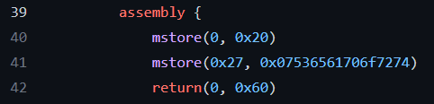
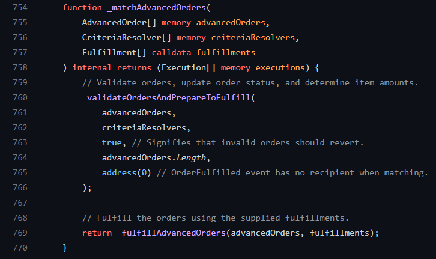
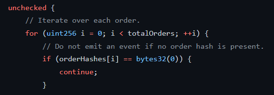

 
 
### Opensea introduce the new protocol for nfts marketplaces, Seaport is a new tool that makes buying and selling nfts safer, with awesome optimization
 
Optimizing the contract is one of the important things we should Observe in writing smart contracts.
 
And every single line in smart contract code has potential 
to make gas higher and lower, Hence we should control the contract gas, and keep it as lower as possible.
 
The web3 dev community is always growing up contracts quality and performance.
Especially Author and code contributors, They've had a lot of impact on the development of the community level.
 
### Let's start with a simple-looking conduit contract.
 
[conduit](https://github.com/ProjectOpenSea/seaport/blob/main/contracts/conduit/Conduit.sol)
[conduit-Controller](https://github.com/ProjectOpenSea/seaport/blob/main/contracts/conduit/ConduitController.sol)
 
which is used for safety checks without owning a core contract, it's just way 
controlling the critical moments, the conduit is executing the transfer of NFTs.
 
we have two contract conduit contracts and also a conduit controller.
 
It's for big marketplaces (like OpenSea) because they have a lot of users and when something goes wrong it helps them to solve the problem and keep users' funds safe.
 
And also they can upgrade the contract without the need to reapprove for all users.
 
Simply users approve the conduit and the conduit executes the transfer order of NFTs in marketplaces.
 
We have channels in the conduit and channels are addressed with allowed transfers and the owner of the conduit contract can remove these and control them.
 
The owner of this contract is the person who deployed this contract.
 
Note: a conduit controller is a contract that deploys conduits, and it may opt to use by users and they approve or not to a conduit.
 
First, let's check what happens at the seaport
 
At first look, we can see the _name function that is for the name of the contract.
 
also, we see some assembly inline codes and a solidity document for assembly codes (https://docs.soliditylang.org/en/v0.8.11/assembly.html)
 
And you can learn EVM upcodes from here (https://www.evm.codes/)
 
In assembly codes, they used 2 upcodes, MSTORE and RETURN.
 
The role of the MSTORE is to push data to memory storage.
 
You can check my article about contract memory storage and how it works, to better understand( https://github.com/0xarshia/smart-contract-memory )
 
As you know MSTORE has 2 stack inputs, the first one is Offset (start from… ) and the second one is value.
 
this means this code stores the data in memory at 0 position and stores the 32
0x20(Hexa) is 32  
 
Assembly code
 
 

 
Both the encoded name and length, actually In here we are optimizing the gas and saving some space.
 
## Now let's check some particular contracts
 
Ordercombiner. sol contract: simply this is an internal function 
to attempt to fill a group of orders, fully or partially. You can check the details in the GitHub repository
Of this contract.
 
Let's start with a particular function like_MatchAdvancedOrders. This function is an order matching function.
 
AdvanceOrders contain the different order objects with their signatures.


 
this contract did great gas optimization for example if you look at the loop in this code they put it into the unchecked and they do ++i instead of i++ which means they reduce the gas as much as they could.


 
The reason that using unchecked is when looping tough elements of an array, each time I order I called automatically underflow overflow checks are made but we already limit by weird area links like a similar than length making those airflow overflow tracks unnecessary it saves gas and as you know since solidity v0.8  under/overflow check is implemented on the language level and you don't need to safe math library in this version.
 
# Why ++i instead of i++, what is the difference between of them
 
i++ is holding two numbers in memory old one +1 and ++I return just number after +1 means it holds 1 number in memory(for example)
 
What happened in i++:
 ```cp
int j = i;
i = i + 1;
return j;
 ```
What happened in ++i: 
 ```cp
i = i + 1;
return i;
 ```
Done, this was a bit explanation of the seaport and a little bit about how its works.
 
 
 
 
 
 
 
 
 
 
 
 
 
 
 
 
 
 
 
 
 
 
 
 
 
 
 
 
 
 
 
 
 
 
 
 
 
 
 
 
 
 
 
 
 
 
 
 
 
 
 
 
 
 
 
 
